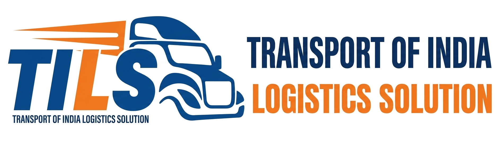

# Transport Of India Logistics Solution (TILS) — Enterprise Web Portal



> **Modern, High-Velocity Logistics & Supply Chain Intelligence Platform**  
> Official multi-page static portal engineered for Transport Of India Logistics Solution (TILS), featuring glassmorphic corporate UI, real-time corridor monitoring displays, interactive rate requests, and multi-modal freight management tools.

---

## 📌 Table of Contents

- [Overview](#-overview)
- [Design System & Palette](#-design-system--palette)
- [Website Architecture & Pages](#-website-architecture--pages)
- [Directory Structure](#-directory-structure)
- [Corporate Identity & Metadata](#-corporate-identity--metadata)
- [Key Features & Interactions](#-key-features--interactions)
- [Installation & Local Setup](#-installation--local-setup)
- [Deployment Guide](#-deployment-guide)
- [Browser Support & Accessibility](#-browser-support--accessibility)
- [License & Credits](#-license--credits)

---

## 🚀 Overview

The **TILS Web Portal** is a production-grade, zero-dependency, static multi-page website built for enterprise-level logistics operations. It merges heavy-haulage reliability with modern digital telematics, featuring clean typography, structured data cards, interactive forms, dynamic metrics counters, and responsive off-canvas navigation.

### Key Highlights:
- **Zero Framework Bloat**: Built purely with semantic **HTML5**, **CSS3 (Custom Properties & Flexbox/Grid)**, and modular **Vanilla JavaScript**.
- **Mobile-First Responsive Design**: Optimized across mobile displays (320px, 375px, 425px), tablets (768px, 1024px), and desktop ultra-wides (1440px+).
- **High Contrast & Corporate Polish**: Crisp white surfaces paired with deep navy blue authority and high-visibility logistics amber accents.

---

## 🎨 Design System & Palette

| Token Name | Hex / Value | Description & Primary Usage |
| :--- | :--- | :--- |
| `--bg-body` | `#FFFFFF` | Core surface background for clean readability |
| `--bg-subtle` | `#F8FAFC` | Secondary container backgrounds and alternating strips |
| `--brand-navy` | `#0B2246` | Primary corporate headers, footers, and structural frames |
| `--brand-blue` | `#0056B3` | Primary action links, active state indicators, and badges |
| `--brand-yellow` | `#FFB800` | Logistics accent, alert badges, and highlight CTA buttons |
| `--text-dark` | `#0F172A` | Primary heading and high-contrast text color |
| `--text-body` | `#334155` | Body paragraphs and descriptive content |
| `--text-muted` | `#64748B` | Captions, metadata, and placeholder text |
| `--border-light`| `#E2E8F0` | Structural dividers, card borders, and input fields |

---

## 📄 Website Architecture & Pages

The application is structured into 9 modular static HTML pages:

1. **`index.html` (Home)**: High-impact hero section, live corridor telemetry tracker, verified trust statistics counters, core services matrix, and client conversion CTAs.
2. **`about.html` (Corporate Profile)**: Company history, vision & mission statements, operational principles, and multi-year milestone timeline.
3. **`services.html` (Freight Services)**: In-depth technical specifications for Full Truckload (FTL), Port Container Drayage, Over-Dimensional Cargo (ODC), and JIT supply chains.
4. **`solutions.html` (Enterprise Telematics)**: Software products including *TILS IntelliRoute™*, *SecureMesh™ IoT Fleet Platform*, and *QuickPOD™ Billing Automation*.
5. **`projects.html` (Case Studies)**: Documented project metrics across heavy engineering, automotive assembly lines, and export garment logistics.
6. **`team.html` (Leadership & Operations)**: Executive profiles, corridor managers, telematics engineers, and safety compliance heads with asset fallback handlers.
7. **`careers.html` (Workplace & Hiring)**: Work culture pillars, healthcare benefits, and active operational and technical job openings with application triggers.
8. **`faq.html` (Knowledge Base)**: Categorized interactive accordion components covering fleet capabilities, GST/E-Waybill compliance, and safety standards.
9. **`contact.html` (Dispatch & Booking)**: Complete registered office details, direct telephone lines, live validated rate estimation form, and interactive map embed.

---

## 📁 Directory Structure

```text
tils-web-portal/
├── index.html                  # Homepage
├── about.html                  # Corporate Profile & Timeline
├── services.html               # Logistics & Freight Catalog
├── solutions.html              # Digital Telematics & Tech Stack
├── projects.html               # Case Studies & Proven Results
├── team.html                   # Corporate Leadership Directory
├── careers.html                # Career Openings & Benefits
├── faq.html                    # Operational FAQ Accordions
├── contact.html                # Dispatch Directory & Route Calculator
│
├── css/
│   ├── style.css               # Core design tokens, global layout, typography, navigation & footer
│   ├── animations.css          # Keyframes, floating telemetry badges, scroll-reveal transitions
│   └── responsive.css          # Adaptive media queries & mobile drawer breakpoints
│
├── js/
│   └── main.js                 # Header scroll spy, drawer controller, number counters, form validation
│
├── assets/
│   ├── logos/
│   │   └── logo.svg            # Official TILS Vector Brandmark & Wordmark
│   └── images/
│       ├── hero/               # Hero background visual assets
│       ├── team/               # Executive & operations headshots (md.jpg, operations-head.jpg, etc.)
│       ├── company/            # Warehouse, hub, and corporate facility photography
│       └── case-studies/       # Multi-axle trucks and ODC field operations imagery
│
└── README.md                   # Comprehensive Technical Documentation
